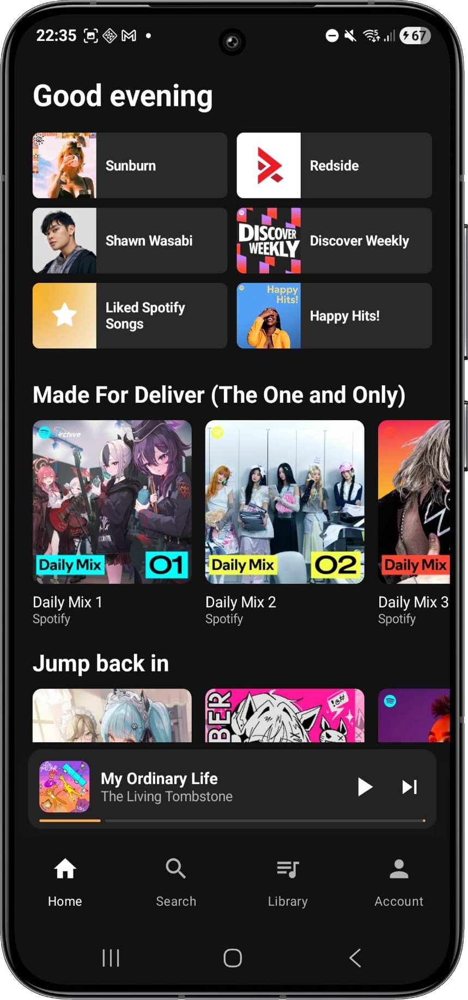
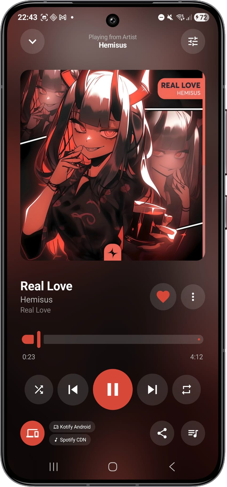
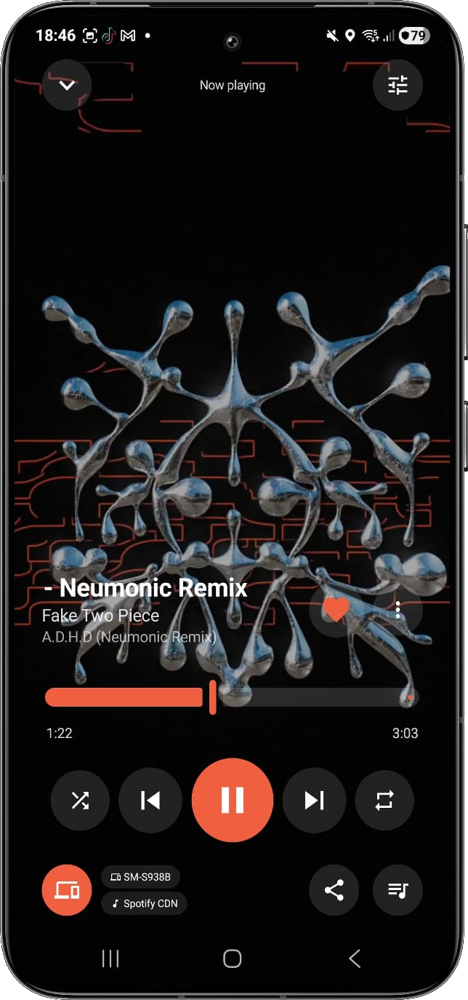
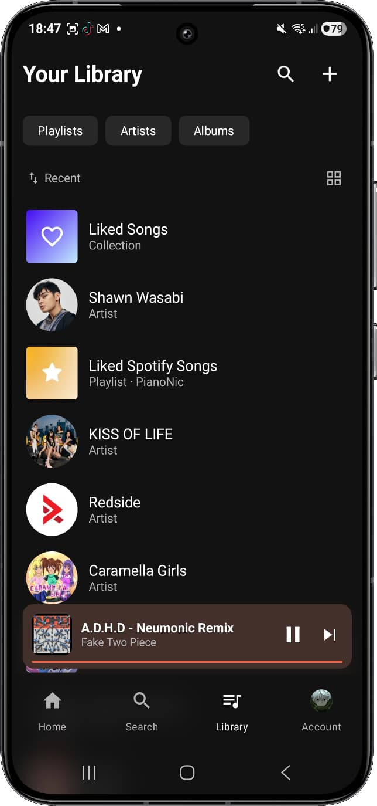

# Snepilatch

A simplicity-focused, open-source music streaming app for Android.

## Features

- Fully native UI built with Jetpack Compose and Material 3
- Full playback controls with Spotify Connect
- Synced lyrics display
- Queue management with direct track navigation
- Library: liked songs, playlists, albums, artists
- Search and browse
- Dynamic color theming from album art
- Gesture-based player with swipe navigation
- Canvas background animations
- Automatic in-app updates

## Tech Stack

- Kotlin + Jetpack Compose (migrated from Flutter + WebView)
- ExoPlayer with Widevine DRM and optimized buffering for native audio playback
- Proprietary KotifyClient for Spotify Connect protocol and real-time WebSocket state
- Protocol-level ad blocking via state machine auto-advance
- Material 3

## Screenshots

| Home | Player | Player | Library |
|------|--------|--------|---------|
|  |  |  |  |

## Installation

Download the latest APK from the [Releases](https://github.com/PianoNic/Snepilatch/releases) page.

## Building from Source

> This project depends on a private library not included in the repository. It will not compile without it.

## Community

[Discord](https://discord.gg/NJxKMSNYRG)

## License

[MIT](LICENSE)
