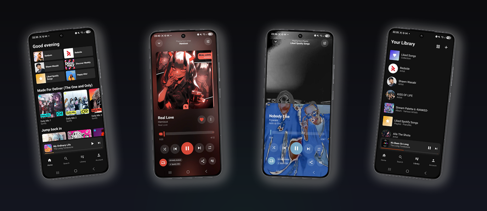

  

<h1 align="center">Snepilatch</h1>

  <strong>A simplicity-focused, open-source music streaming app for Android.</strong>

  
  
  

---

## Features

- Fully native UI built with Jetpack Compose and Material 3
- Full playback controls with Spfy Connect
- Synced lyrics display
- Queue management with direct track navigation
- Library: liked songs, playlists, albums, artists
- Search and browse
- Dynamic color theming from album art
- Gesture-based player with swipe navigation
- Canvas background animations
- Automatic in-app updates

## Screenshots

## Installation

Download the latest APK from the [Releases](https://github.com/PianoNic/Snepilatch/releases) page.

## Building from Source

> This project depends on a private library not included in the repository. It will not compile without it.

## Community

[Discord](https://discord.gg/NJxKMSNYRG)

## License

[MIT](LICENSE)
