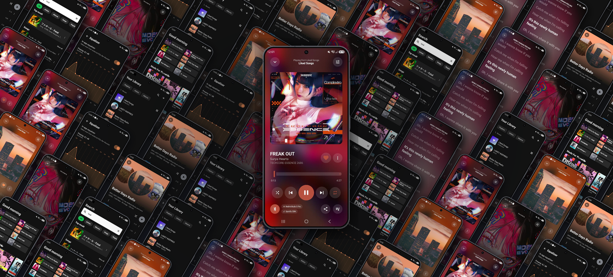

  

<h1 align="center">Snepilatch</h1>

  <strong>A simplicity-focused, open-source music streaming app for Android.</strong>

  
  
  

  

## Features

| Playback | Sound |
| --- | --- |
| <ul><li>Plays locally on your phone as its own Connect device, so transport actions are never skip-capped</li><li>Ad-free listening</li><li>Choose your audio source: the standard stream, optional lossless, or YouTube Music</li><li>Full Connect control: transfer to and from other devices</li></ul> | <ul><li>Ten-band in-app equalizer with a drag-and-drop curve editor</li><li>Automatic gain staging so boosted bands cannot clip</li><li>EQ headroom for anyone running an external equalizer such as Wavelet</li></ul> |
| **InfiniPlay** | **Library and browsing** |
| <ul><li>Turns any track into a never-ending remix, beat-matched and crossfaded in the audio chain</li><li>Builds a beat graph from the waveform itself, with no per-track analysis API</li></ul> | <ul><li>Liked songs, playlists, albums, artists and podcasts</li><li>Search, home feed, and queue management in a bottom drawer</li><li>Word-level synced lyrics</li></ul> |
| **Interface** | **Languages and updates** |
| <ul><li>Fully native UI built with Jetpack Compose and Material 3</li><li>Dynamic color theming from album art</li><li>Gesture-based player with swipe navigation</li><li>Canvas background animations</li></ul> | <ul><li>English, German, Russian and Swiss German</li><li>Automatic in-app updates</li></ul> |

## Installation

Download the latest APK from the [Releases](https://github.com/PianoNic/Snepilatch/releases) page.

## Building from Source

> This project depends on a private library not included in the repository. It will not compile without it.

## Community

[Discord](https://discord.gg/NJxKMSNYRG)

## Credits

The YouTube Music audio source follows the approach shown by [Meld](https://github.com/FrancescoGrazioso/Meld) and its [Metrolist](https://github.com/MetrolistGroup/Metrolist) / [OuterTune](https://github.com/DD3Boh/OuterTune) / [InnerTune](https://github.com/z-huang/InnerTune) lineage.

No code of theirs is used; this is an independent implementation.

## License

[MIT](LICENSE)
