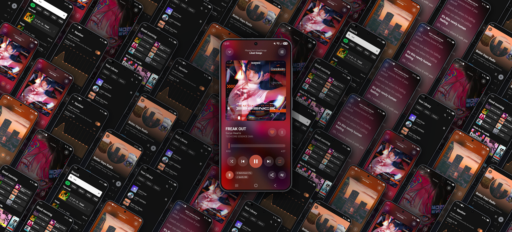

  

<h1 align="center">Snepilatch</h1>

  <strong>A simple, open-source music streaming app for Android.</strong>

  
  
  

  

## Features

| Playback                                                                                                                                                                                                                                                                     | Sound                                                                                                                                                                                                                                                                |
| ---------------------------------------------------------------------------------------------------------------------------------------------------------------------------------------------------------------------------------------------------------------------------- | -------------------------------------------------------------------------------------------------------------------------------------------------------------------------------------------------------------------------------------------------------------------- |
| <ul><li>No ads, ever</li><li>Skip as much as you want</li><li>Choose your audio source: Normal, Lossless, or YouTube Music</li><li>Cast playback to your speaker or laptop and take it back whenever you want</li><li>Smart Shuffle mixes in songs you might enjoy</li></ul> | <ul><li>Built-in 10-band equalizer with a fully customizable curve</li><li>Turn up the volume without unwanted distortion</li><li>Works nicely alongside equalizer apps like Wavelet</li></ul>                                                                       |
| **InfiniPlay**                                                                                                                                                                                                                                                               | **Offline**                                                                                                                                                                                                                                                          |
| <ul><li>Turn any song into an endless remix</li><li>Loop sections on the beat for seamless transitions</li></ul>                                                                                                                                                             | <ul><li>Download songs, albums, and entire playlists to your device</li><li>Keep listening without an internet connection and resume automatically when you're back online</li><li>Choose where your downloads are stored and pause them whenever you want</li></ul> |
| **Lyrics**                                                                                                                                                                                                                                                                   | **Friends**                                                                                                                                                                                                                                                          |
| <ul><li>Word-by-word synced lyrics that highlight as the song plays</li><li>Support for duets, backing vocals, and songwriters</li><li>Tap any line to jump to that part of the song</li><li>Flip the album artwork to reveal the lyrics</li></ul>                           | <ul><li>See what your friends are listening to and join them with one tap</li><li>Start listening together through a link or QR code</li><li>Use multiple accounts and switch between them with one tap</li><li>Set your own profile picture</li></ul>               |
| **Your Music**                                                                                                                                                                                                                                                               | **Looks**                                                                                                                                                                                                                                                            |
| <ul><li>Liked songs, playlists, albums, artists, and podcasts</li><li>Search, browse your home feed, and access your queue with a swipe</li><li>Scan a QR code to open a song</li><li>Shared links open directly in the app</li></ul>                                        | <ul><li>Colours that adapt to the album artwork</li><li>Swipe your way through the player</li><li>Animated artwork while your music plays</li><li>Built for Android, with a native feel</li></ul>                                                                    |
| **Make It Yours**                                                                                                                                                                                                                                                            | **Languages**                                                                                                                                                                                                                                                        |
| <ul><li>Choose what swiping left or right on a song does</li><li>Choose the extra button shown in the player</li><li>Choose which two actions appear in the notification</li><li>Customize the app's appearance and behaviour in one place</li></ul>                         | <ul><li>🇨🇭 **Swiss German**, because the app is made in Switzerland</li><li>English, German, and Russian</li><li>More languages can be added in future releases</li></ul>                                                                                          |

> [!CAUTION]
> Snepilatch is an unofficial client. Use it at your own risk. If you are concerned about account safety, consider using an alternative account, as I cannot guarantee the safety of your account.

## Installation

Download the latest APK from the [Releases](https://github.com/PianoNic/Snepilatch/releases) page.

## Building from Source

> This project depends on a private library that is not included in this repository. As a result, the project cannot be built from source without access to it. Contact me on Discord if you would like to request access.

## Community

Join the community on [Discord](https://discord.gg/NJxKMSNYRG).

## Credits

The lyrics view is inspired by [Spicy Lyrics](https://spicylyrics.org), and the lyrics themselves are provided by its excellent [developer API](https://developers.spicylyrics.org).

## License

[MIT](LICENSE)
