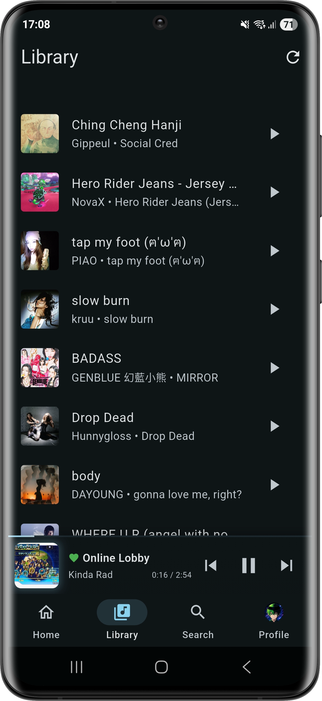
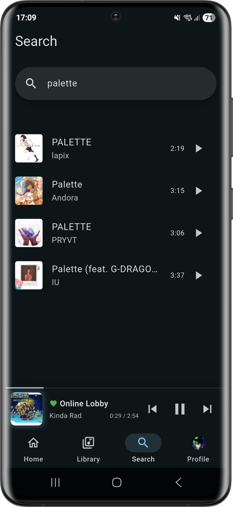

# 
SNEPILATCH

  

  <strong>An open-source music streaming frontend for Android.</strong>

  
  
  

## Features
- Clean, intuitive interface
- Homepage with music discovery
- Library for organizing your music
- Browse artists, albums, and playlists
- Full playback controls
- Quick search functionality
- Material Design aesthetics
- Automatic updates
- Open source & transparent

## Screenshots

  
  
  
  

## Installation
Check the [releases page](https://github.com/Pianonic/snepilatch/releases) for the latest APK.

## Community
Join our [Discord Server](https://discord.gg/NJxKMSNYRG)

## License
MIT License - See [LICENSE](https://github.com/Pianonic/snepilatch/blob/main/LICENSE) file for details.

---

Made with ❤️ by <a href="https://github.com/Pianonic">Pianonic</a>

