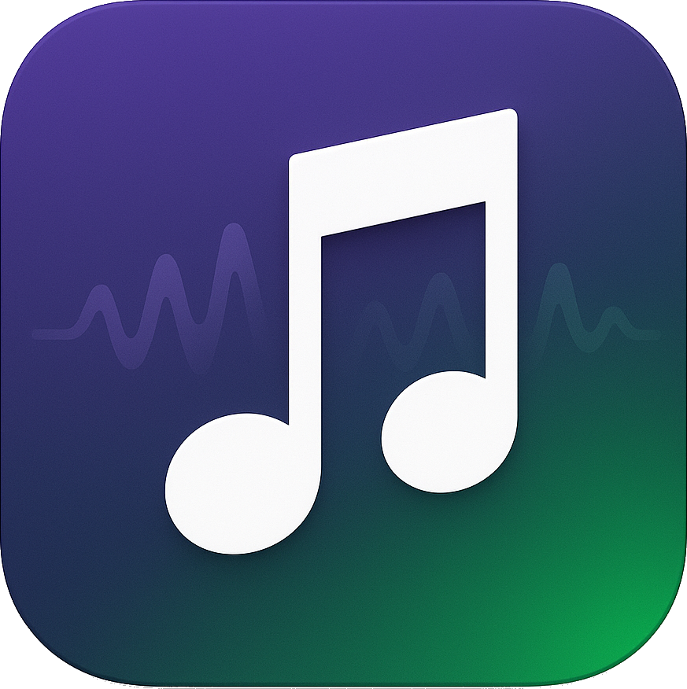

# 
SNEPILATCH

  

  <strong>An open-source, simplicity focused Spotify alternative frontend for Android.</strong>
  Experience your music your way.

  
  
  
  

## 🚀 Features
- **Intuitive UI**: Clean, modern interface built with Kotlin, optimized for Android.
- **Material 3 Design**: Modern and consistent UI/UX with Material You aesthetics.
- **Simplicity**: A straightforward and uncluttered user experience.
- **Music Browsing**: Easily navigate artists, albums, and playlists.
- **Playback Control**: Seamless playback management with standard controls.
- **Search Functionality**: Quickly find your favorite tracks, artists, or albums.
- **Open Source**: Full transparency and community-driven development.
- **Android Native**: Optimized performance and experience on Android devices.

## 📜 License
This project is licensed under the MIT License.
See the [LICENSE](https://github.com/Pianonic/snepilatch/blob/main/LICENSE) file for more details.

---

Made with ❤️ by <a href="https://github.com/Pianonic">Pianonic</a>
